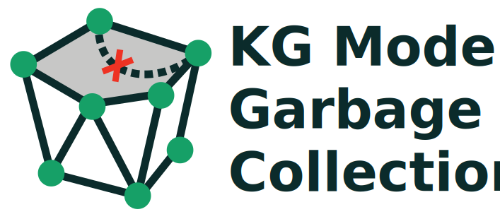

# Model Garbage Collection



Biomedical knowledge graphs are powerful tools for linking genes, diseases, and phenotypes — but when AI models generate new edges, they often hallucinate or introduce errors. Our project focuses on pruning these errors. The Model Garbage Collection Tool is a proof-of-concept for how a combination of human review, grounded AI, and graph learning can work together to keep biomedical knowledge graphs accurate and trustworthy.

The Model Garbage Collection Tool uses a subset of a trusted graph (Monarch) and randomly removes some edges.  Then, three strategies are used to fill the missing edges: random guessing, a general LLM, and an LLM using RAG. Participants (SMEs) validate (some of) these edges through a simple interface to evaluate how close each method comes to the truth. This data is used to train a graph neural network to see if it can automatically spot questionable edges and flag them for review and removal. The resulting knowledge graph is tested it against the original, trusted knowledge graph. 

## Problem
Generating KGs at scale requires use of LLMs which can introduce errors. In biomedicine, mistakes could lead to errors that cause harm to people. One way to mitigate the risk of harm is HITL, but that is not a scalable solution for a large, complex KGs. 

## Solution
The Model Garbage Collection Tool is a PoC allowing curators to probe a KG using real scientific questions, provide feedback, and use that feedback to train a GNN. This tool is a PoC to expand the impact of human curation and remove bad data at scale.


## Methods

### Data Preparation
#### Subgraph creation
For purposes of the hackathon, we needed a workable test set. We queried the Monarch Knowledge Graph to retrieve an extended network of entities associated with Alzheimer's disease, including related genes, phenotypes, and neurodegenerative conditions. We then extracted first- and second-degree connections to generate a subgraph containing approximately 1,700 edges, which is then saved as a JSON file for further analysis. This approach enables comprehensive exploration of the molecular and phenotypic landscape surrounding Alzheimer's disease. 

#### JSON to CSV conversion
A custom function `parse_edges_to_csv()` extracts `subject`, `predicate`, and `object` fields from the raw `edges.jsonl` file into a clean CSV format. Invalid JSON lines are skipped, ensuring robust parsing.  

```
python
   parse_edges_to_csv("./data/example_edges.jsonl", "edges_output.csv")
```

#### Simulating missing links
We then randomly removed a percentage of edges to create “ground-truth missing links” for evaluation with select_chunk_and_remove_predicates(). 50% of predicates were removed per predicate type to create “masked” graphs for edge reconstruction experiments. Both the original and modified chunks were saved for later comparison.
This produces paired datasets: one with full edges (ground truth) and one with missing predicates (test set).

```
original, modified = select_chunk_and_remove_predicates(
    "edges_output.csv",
    chunk_size=100,
    predicate_removal_percent=50,
    output_file="modified_chunk.csv"
```

#### Edge Reconstruction Strategies (planned)
We compared three strategies for predicting missing edges:  
1. **Random Guessing** – Uniformly sampling possible edges as a naive baseline.
3. **General LLM** – Using a large language model (Google Gemini API) without external grounding.
4. **LLM + RAG (PubTator3)** – Querying the same LLM augmented with retrieval from PubTator3, which mines biomedical entities and relations from PubMed abstracts.

#### Backbone graph generation (planned)
We took the reconstructed subgraphs into even smaller graphs of 10-30 edges to form the basis of a contextual dataset for benchmarking in the time available during a hackathon.

### Edge Scoring (planned)
To identify potentially spurious connections, we computed edge scores using personalized PageRank (PPR) combined with a Conductor-based scoring function. The resulting locality-informed subgraphs were passed to a graph neural network (GNN) trained as a discriminator. The GNN assigned likelihood scores to edges, producing a ranked list of candidate edges for pruning.
Train a GNN classifier using:
- Topological features (degree, connectivity, edge type frequency).
- Edge prediction scores from Random, LLM, and LLM+PubTator3 approaches.
- Objective: flag questionable edges for curator review.
- Evaluation will compare predictions against the original trusted KG (Monarch)..

### Human-in-the-Loop Validation (planned)
Edges ranked lowest by the discriminator were flagged for human review. Expert curation was used to refine pruning decisions and remove erroneous connections. The curated edge sets were then reintegrated into the training process, enabling iterative retraining of the GNN discriminator for improved performance.
- SMEs will review predicted edges via a simple web interface.
- Responses (true / false / uncertain) will be logged.
- These validated labels will provide supervision for training the GNN.

### Evaluation (planned)
- Metrics: precision, recall, F1 for each reconstruction strategy.
- Compare baseline (random) vs LLM vs LLM+PubTator3.
- Assess GNN’s ability to generalize SME judgments to unseen edges.

## Data Sources
The Model Garbage Collection tool uses and displays data and algorithms from the Monarch Initiative. The Monarch Initiative (https://monarchinitiative.org) makes biomedical knowledge exploration more efficient and effective by providing tools for genotype-phenotype analysis, genomic diagnostics, and precision medicine across broad areas of disease.
