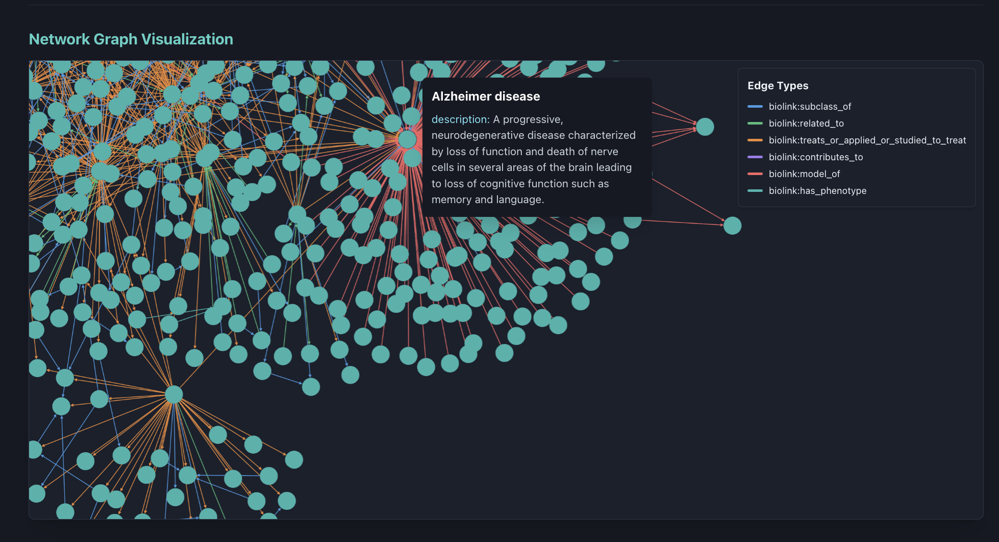
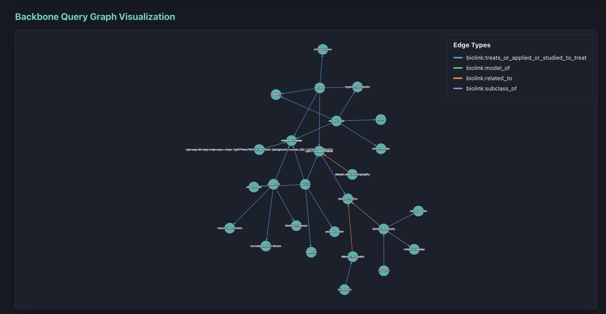
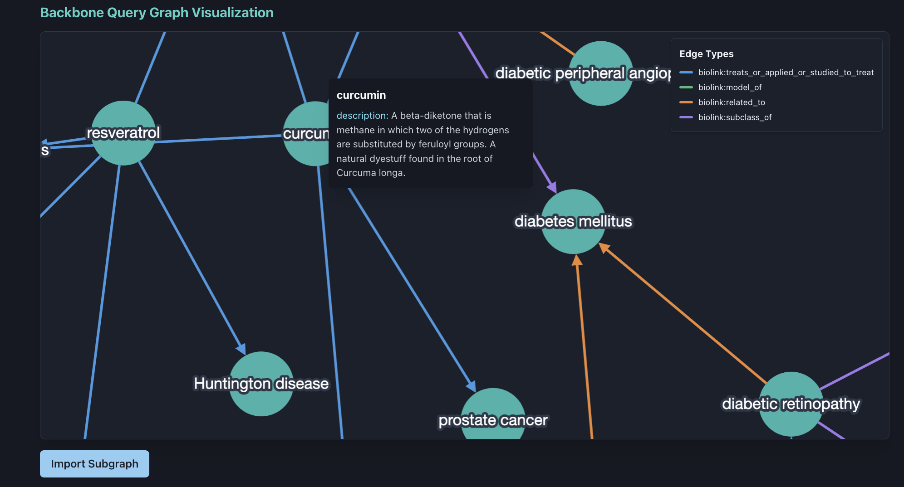
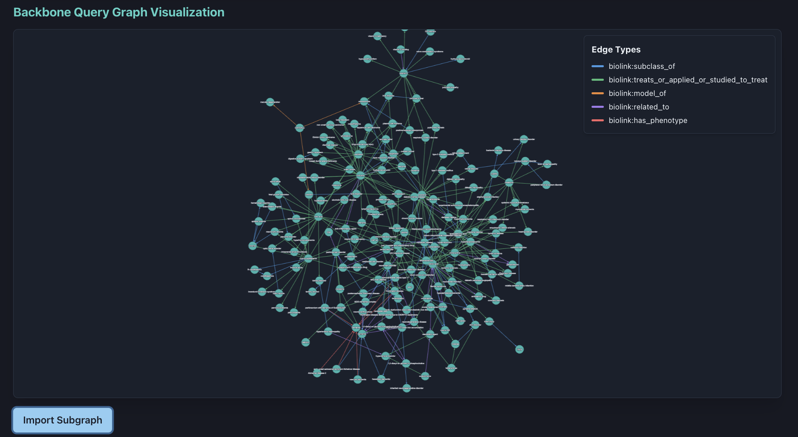
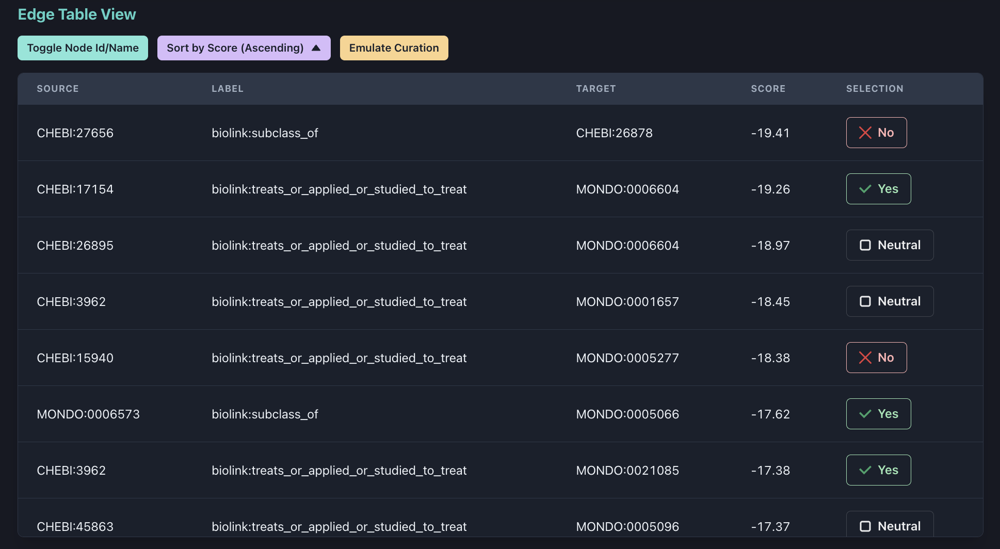

# Model Garbage Collection - Frontend

A modern web application built with Preact, TypeScript, Vite, and Chakra UI.

## Tech Stack

- **Preact** - Fast 3kB alternative to React
- **TypeScript** - Type-safe JavaScript
- **Vite** - Next generation build tool
- **Chakra UI** - Component library with dark theme
- **Cytoscape.js** - Graph visualization library
- **@preact/signals** - Reactive state management
- **Yarn** - Package manager

## Getting Started

### Prerequisites

- Node.js (v16 or higher)
- Yarn package manager

### Installation & Running

1. **Navigate to the frontend directory**
   ```bash
   cd app/frontend
   ```

2. **Install dependencies**
   ```bash
   yarn install
   ```

3. **Start the development server**
   ```bash
   yarn dev
   ```

4. **Open your browser**

   The app will be available at `http://localhost:5173`

   You should see:
   - Statistics dashboard
   - Interactive graph visualization with force-directed layout
   - Counter and user profile components

### Build for Production

```bash
yarn build
```

### Preview Production Build

```bash
yarn preview
```

## Features

- 🌙 Dark theme by default
- 📊 Interactive graph visualization with Cytoscape.js
- 🎯 Force-directed graph layout
- 🔍 Node hover tooltips showing all properties
- 🔴 Edge highlighting functionality
- ⚡ Signals-based state management
- 🎨 Chakra UI component library
- 📱 Responsive design
- 🔥 Hot Module Replacement (HMR)
- 📦 Optimized production builds with Vite

## Project Structure

```
frontend/
├── src/
│   ├── components/
│   │   ├── CounterCard.tsx    # Counter with signals demo
│   │   ├── UserCard.tsx       # User profile component
│   │   ├── StatsCard.tsx      # Statistics display
│   │   └── GraphView.tsx      # Graph visualization component
│   ├── store.ts               # Signals state management
│   ├── theme.ts               # Chakra UI theme configuration
│   ├── App.tsx                # Main app component
│   └── main.tsx               # App entry point
├── index.html                 # HTML template
├── vite.config.ts             # Vite configuration
└── tsconfig.json              # TypeScript configuration
```

## Graph Visualization

The `GraphView` component accepts graph data in the following format:

```typescript
{
  elements: {
    nodes: [
      {
        data: { id: "node1", label: "Node 1", /* custom properties */ },
        position: { x: 100, y: 100 }  // optional
      }
    ],
    edges: [
      {
        data: {
          id: "edge1",
          source: "node1",
          target: "node2",
          interaction: "relationship"  // optional label
        }
      }
    ]
  }
}
```

**Features:**
- Automatic force-directed layout (cose algorithm)
- Hover over nodes to see all properties
- Pass `highlightedEdges` prop to highlight specific edges by ID
- Fully customizable styling

# Application Walk Through
The application is a data dasbhoard for a curator-driven, AI assisted, knowledge graph pruning journey. Our user journey is predicated on the following assumptions:
1. There is no magic button to remove all wrong edges
2. There is no super curator that knows all biology.
3. A domain expert curator, is best equipped to tailor assertions in a small, bounded context. 

## full knowledge graph
The application loads the full knowledge graph. 




The graph is interactive. It features a legend with color-coded relationships. In reality, most source knowledge graphs will be too large for direct visualization. Future directions can tackle this problem by:
- using graph coarsening or graph pooling functions via GNN
- 3D node embeddings and rendering the graph in 3D


## Query backbone
The next step is for a the knowledge curator to enter a biological query in plain text (workflow not shown). The backend should return a minimal set of edges related to the curator's focused query. We call this the query backbone.



Under the hood, this backbone is viewed with the sam `GraphView` component as the full graph. It supports all the same features.




## Import Subgraph
Although the backbone are the most immediately relevant relations connecting the curator's query, it represents a low surface area of the overall knowledge graph. In order to maximize the effect of a curator's feedback, we expand the backbone with a high-conductance "optimized" subgraph.



This subgraph is tailored to the query backbone, but represents sufficient knowledge context.

## Learn and Score Graph
The curator hits the "learn graph button" (not shown). The backend runs the Locality Informed Link Prediction Graph Neural Network, to learn a discriminator for every existing edge in the subgraph. The result of this learning is a numerical scalar score for every edge. 

### View Edge Scores
After learning, the curator is presented with a table; one row for every edge in the subgraph. Each row includes a learned score, with negative and positive scores. Negative scores point to edges with low discriminator performance, while positive edges point to edges with higher discriminator performance. 

The curator can review each relation, one by one, in the context of their original query and provide feedback to the system. A curator may approve (Green `Yes` badges), disapprove (Red `No` badges), or offer no feedback (`Neutral` badges).





### Submit Feedback

> !NOTE
> This workflow is not shown!

The backend receives the user feedback and continues learning the discriminator for the subgraph. We have modified the original GNN algorithm to include user feedback as bias in the scoring. We were able to get this running. We were not able to evaluate the performance or accuracy of this implementation. 


The desired workflow is to receive subsequent scores for each round of feedback, such that the scores eventually converge (to the extent possible) to the curators understanding of the relevant biology and biomedical literature. At any point the user can remove all edges scored under some curator-defined threshold. 